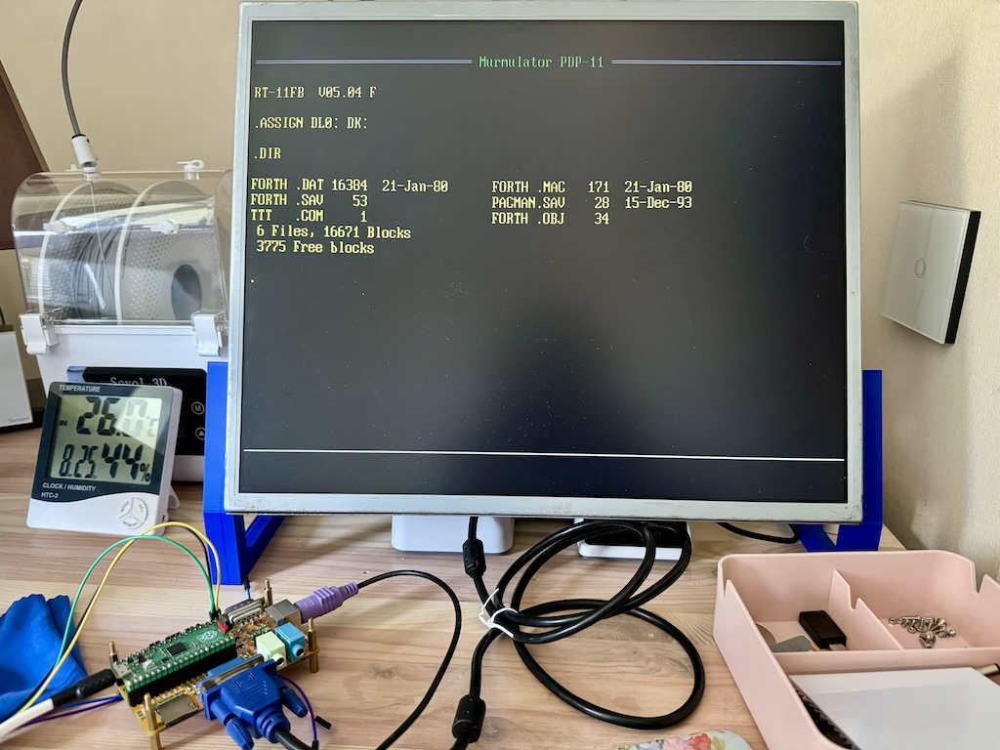

# pdp-11 on Murmulator

Задача проекта - скрестить бульдога с носорогом и жирафом.
А именно - 

1. Берем железо платформы [Мурмулятор](https://murmulator.ru)
2. Эмуляцию PDP-11 на Raspberry Pi pico - от [Pico-1140](https://github.com/Isysxp/Pico_1140)
3. Реализацию команд терминала VT100 - от [VersaTerm](https://github.com/tsybulin/VersaTerm)
4. ✓ После чего адаптируем 2) под 1)
5. ✓ Выбрасываем из 2) все драйвера и вручиваем новые VGA, PS/2, SD Card от 1)
6. ✓ Стандартную консоль KL11 из 2) отдираем от UART0 и переписываем её для работы с VGA экраном 640x480x60 текст 80x30 и  PS/2 клавиатурой.

Если весь этот зоопарк взлетает, то движемся слегка дальше:

7. ✓ В консоль 6) добавляем эмуляцию VT100 переосмысливая куски от 3)
8. ✓ Вторую консоль DL11 дотачиваем для корректной работы на новых выводах UART0 (стандартные заняты клавиатурой ps/2)

И если и тут получится, то (сапсем мечты)

9. Вкручиваем меню загрузки на старте железяки.
10. ~~Потенциально подключаем usb порт для работы с usb клавиатурами.~~

## Хе-хе, проверка идеи.

Таки оно да, жизнеспособно в принципе, пп. 1..6 сделаны.

Пруф:

~~Ой.~~

**Upd**:
~~Пока нет 9) действуем так:~~
  - на SD карте в корне создаем руками каталог PDP-11
  - кладем в него загрузочный образ RK диска, называем его BOOT.RK05
  - кладем в него образ RL диска и называем его WORK.RL02
  - копируем сюда из примера файл конфигурации CONFIG.INI

  Ой.

